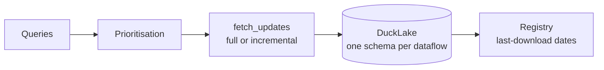

# Incremental downloads

[`download_updates`][statflows.core.download.download_updates] is a one-call
wrapper around [`SDMXDownloader`][statflows.core.download.SDMXDownloader]. For a
list of queries it:

1. **prioritises** the queries — series absent from the registry first;
2. runs a **full download** for the series not yet stored, and an **incremental
   download** (only what was published since the recorded date) for the others,
   through `client.fetch_updates`;
3. **writes** each result into a DuckLake catalog, one schema per *dataflow*
   (creation on the first write, upsert by primary key afterwards);
4. records the date of the last download of every query in a **JSON registry**,
   stored locally or on S3.

!!! note "Registry invariant"
    A registry entry **never** advances before the data of its query has been
    written. A failed write leaves the entry untouched: the query is simply
    downloaded again on the next run.

## The run report

`download_updates` returns a [`DownloadReport`][statflows.core.reports.DownloadReport]
(queries processed, rows written, errors, HTTP and rate-limit statistics,
`stopped_early`), made of one [`QueryReport`][statflows.core.reports.QueryReport]
per query. `report.to_metrics()` flattens it for an experiment tracker; the
`on_query_complete` callback streams each `QueryReport` as soon as it is ready.

## Time limit and graceful shutdown

`max_runtime` (23 hours by default) stops the loop between two queries once the
deadline has elapsed. On `SIGTERM` — e.g. a Kubernetes pod being stopped — the
fetch in progress is aborted, pending writes and the registry are flushed, and
`run()` returns its report with `stopped_early=True`.

## Reading the registry

Downstream steps read the registry with
[`iter_registry_entries`][statflows.core.registry.iter_registry_entries], which
works whether the registry is a single file or sharded, local or on S3, and
yields frozen [`RegistryEntry`][statflows.core.registry.RegistryEntry] objects.

For large catch-ups, see [Performance and volume](performance.md).
